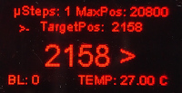
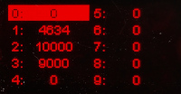
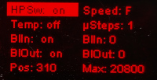

# wFocuser (extension of myFocuserPRO2 ESP)

This is my private extension of the original "myFP2ESP Firmware for ESP32 and ESP8266 myFP2ESP Controllers" by Robert Brown, Holger Manz and Paul Porters, forked from the [brownrb/myFP2ESPFirmware](https://github.com/brownrb/myFP2ESPFirmware) repository. The original README.md is renamed to [README.myFP2ESP.md](README.myFP2ESP.md) and contains links to the original project information and documentation.

## Motivation and changes

MyFocuser is a marvellous project (actually a group of projects) for building DIY electronic focusers primarily aimed at astrophotography. They cover various combinations of hardware components suitable for differently sized equipment (telescopes or photolenses). However, the broad field of supported components and their features has its limits, of course. Once you get used to the peculiarities of this project and occasional inconsistencies or contradictions within the otherwise admirable, long and detailed documentation, you may want to adapt or extend the focuser to your own needs or ideas. My desire was to get beyond two basic limitations of the original project based on the ESP32 microcontroller:
1. MyFocuser is primarily aimed at *remote control*, but it already implements two pushbuttons for local quick adjustment of the focus and an OLED display for information about the focuser. I wanted to be able to use the pushbuttons to control all the main functions of the focuser *locally*, too. For that purpose I added two more pushbuttons and extended the source code of the firmware to fully utilize the possibilities of the OLED display.
2. The original documentation expects you to use one of the pre-designed PCB boards. That seems rather a complication to me (where to get it?) and it also expects you to place the focuser board into a relatively large box and use robust cable interconnections with other components (stepper motor, sensors etc.); I wanted a more compact and lightweight build suitable for travelling with my portable equipment (ExploreScientific iExos-100 mount controlled by a small Astroberry) which could ideally be fixed directly to the telescope tube.

My build is based on the ESP32 controller, SH1106 OLED 1,3" display, TMC2209 driver and a NEMA17-PG27 motor. I tried to modify the firmware with the effort of the minimal possible interventions in order to keep backward compatibility with all the originally supported hardware components and features, but I cannot guarantee I did not really break anything. I cannot test or "support" any other hardware combinations (beyond theoretical help), but I tried to avoid disrupting any of the functionality of the original firmware.

The changes concern:

- the original pushbuttons (called UP/DOWN) have their primary functionality modified so that they can move the focuser in smaller or larger (but exact) amount of steps, depending on the length of their press
- adding two more push buttons called MOD(ifier) and SET to control all functions of the focuser locally via an interactive menu; use of an OLED display is needed

## Advanced control in detail

The display can show 4 different basic screens (pages) which can be switched by a short press of the SET button:

1. MAIN page is almost identical with the original screen in OLED_GRAPHIC mode: it shows the focuser's current position, direction of movement and target position, as well as the maximal position, step size, backlash, temperature (if available), "heart beat" symbol and an additional symbol to indicate connection of remote client; only this page allows the UP/DOWN buttons to be used to move the focuser interactively\

2. PRESET page allows to apply one of the 10 available presets or to edit/change their values\

3. SETTINGS page allows to change the following 10 most important settings: enable or disable home position switch, temperature probe, backlash-in and backlash-out compensation; changing the value of the current and maximal position (without moving the focuser); changing motor speed, step size, backlash-in and backlash-out amount of steps\

4. NETWORK information: showing the current SSID and IP address of the WiFi connection and state of the remote client connection (ASCOM/INDI)

### Turning the display ON/OFF

The original behaviour of myFocuser is kept: when the firmware stores the changed position or settings into permanent memory, the display turns off automatically; this usually happens 30 seconds after the last movement or change of any setting. However, manual control can also be used:

- pressing any button (also just the MOD button) turns the display on
- long press of the SET button turns the display off

This behaviour is available independently of the screen/page shown.

### MAIN page

- UP/DOWN buttons can be directly used to move the focuser: a short press moves it immediately by a single step, if the button remains pressed for at least 200ms, it adds 9 more steps to reach the sum of 10, and a very long press (>900ms) adds another 90 steps to reach a full movement of 100 steps; this functionality is not dependent on the availability of a display and can be disabled by commenting out the line `#define ADVANCED_PB_MOVEMENT` in `focuserconfig.h` (then the buttons will behave as in the original firmware); at the same place in the configuration, you can also modify the press length times/thresholds for the short/bold and long press (`BOLDPRESS`, `LONGPRESS`) and the step sizes for each movement phase (`SHORT_STEPS`, `BOLD_STEPS`, `LONG_STEPS`)
- MOD + UP/DOWN: changes the numeric value of the target position shown on the display (the longer you press the buttons, the faster the numbers change); unlike the direct movements, where the UP button moves the focuser inwards (towards position 0) and the DOWN button outwards (towards maximal position), here the UP button changes the value up towards the maximal position and the DOWN button down to zero
- MOD + SET: move the focuser to the target position set by pressing MOD + UP/DOWN; a confirmation screen will appear (press UP to confirm or DOWN to cancel the movement)
- MOD + SET (long press): move the focuser to home position 0 (confirmation will be required too)

### PRESET page

- UP/DOWN: move between the 10 presets; if some preset value is already changed, a confirmation will be required to store or cancel the new value before moving to another preset
- MOD + UP/DOWN: change the value of the current preset; a changed value is indicated by the cursor changing into a rectangle (losing its inversion)
- MOD + SET: move the focuser to the currently selected preset position; confirmation will be required; if the preset value has been changed, another confirmation to store the value will be required first
- MOD + SET (long press): current focuser position will be set as the new value for the selected preset
- SET: switching to next page will cancel any change to the value of the current preset

### SETTINGS page

- UP/DOWN: move between the 10 available settings
- MOD + UP/DOWN: changes the current setting value; on/off values are changed immediately, numeric values are changed like the presets and need to be confirmed in order to be stored permanently (after moving UP/DOWN, away from the current setting)

## Hardware changes

After some experiments, I found out the 28BYJ-48 won't be capable to reliably move the focuser of my telescope. Therefore I deployed the "large and heavy" NEMA17-PG27 which also has very fine steps without the need for microstepping.

I managed to fit the whole controller (including the 4 push buttons) onto a small 40x60mm PCB breadboard as documented in detail in the [hardware](hardware/) folder. Together with the motor and the 1,3" OLED display, it fits comfortably into a box the size of 112x75x58mm. Of course, my build is not as robust and "clean" as the original projects based on a proper PCB and quality wiring.

The two additional pushbuttons (=the GPIO pins they are connected to) must be configured in the board configuration JSON file uploaded to the board. I modified only the `data/boards/57.jsn` configuration for the TM2209 drivers. If you use a different driver, you have to add the two additional GPIO pin assignments to the corresponding configuration file.

By accident, I also connected the second button (DOWN) to GPIO 25 instead of the original GPIO 35. But you can just revert that setting in `data/boards/57.jsn` and use the original pin.

## TMC2209 and StallGuard (remaining problems)

I did not manage to make the StallGuard work with the NEMA17-PG27 motor. The StallGuard alert is triggered by the TM2209 at nearly every start and stop of the motor movement (especially when several short moves follow each other), whatever value of the SG threshold I tried. For now, I have attached an infrared sensor to detect the home position, but a mechanical switch would probably be more precise. I still wonder whether accelerated driver control (such as AccelStepper or FastAccelStepper) would possibly help as suggested in some discussions about this kind of problems with TMC2209.

I also didn't find any real effect of all the TM2209 calculations and settings suggested in the documentation. The most important one of them (the CS value) is not set anywhere in the original firmware code anymore. I didn't observe any significant change when playing with the values, nor any significantly helpful effect on the false StallGuard alerts. But I am no expert in motor control, so I would be very thankful for any better explanation.

I also did not find the default microstepping of 4 helpful in combination with the PG27 gear of the motor and set it back to 1. Also the motor speed delay of at least 2000 seems more appropriate for the motor. Those are the other changes in the default TM2209 configuration in `data/boards/57.jsn`.

## Other questions I did not find an answer to in the official documentation

(Maybe just because I did not read everything thoroughly enough?)

#### What is the exact original behaviour of the pushbuttons?

As stated in the documentation, the pushbuttons are (originally) suitable for finer adjustments of the focuser, but not for significant movements. In practice, the pushbuttons move the focuser by a single step as long as they are pressed. That means: by one step each time the button is tested for press. The buttons are not tested when the focuser is moving. But single step movements are very short, so that you always get a movement of several steps at once even if you press the button just shortly. If you keep it pressed, the movements start to add in short intervals, so that you can reach a change of position of several dozens steps in reasonable time. In this way, you can realistically move the focuser by about 100 steps or even more with a bit of patience, but larger movements would just take too much time (several minutes).

#### Do I need to buy components from the suggested sellers?

Of course not. But if you want to use the pre-designed PCBs, you have to watch out that you buy an identical version with the same dimensions and pinout. The ESP32 modules are produced in various versions. They may have a different number of pins even though they look similar. Basically, the ESP32 modules with a single row of pins on each side are produced with 2x15 pins or 2x19 pins - the first one is the one you want for this project.

You need to take care especially in the case of the TMC2209 modules. The version from BigTreeTech is probably really unavoidabe, because other modules have not only a different pinout, but they may even be missing some important pins completely.

#### Do I need to use the pre-designed PCB?

No. But the whole documentations expects you to do it. The original PCB designs support all the available options and you may freely switch between them. That is not necessarily what you plan to do. However, you may change your mind when you try working with the focuser, so this gives you some flexibility. The original PCB gives you a lot of flexibility and robustness, but it also takes some space.

The whole wiring is actually not as complicated as it may seem at the first look. The most "complicated" is the power circuit. It contains a voltage regulator to reduce the 12V power to the 8V or 5V needed by the microcontroller, three or four capacitors, a diode and a fuse. All the rest are just interconnections between the ESP32 and its peripherals (with occasional pull-up or pull-down resistors): the stepper driver, OLED display, joystick or push buttons, temperature probe and IR sensor. The default wiring scheme also includes additional jumper headers to allow you to switch between the exclusive options in case you change your mind. These make the wiring seem more complex than it is.

#### What are all the options available?

It may be a bit difficult to find your way among all the options and variants of myFocuser at first. A great deal of information is spread to several places in the documentation and while there may be occasional inconsistencies or even contradictions between them, it is worth to find all the relevant places and read them. So, what do you need to read from the rich and detailed documentation and what you just may skip?

First, you need to choose the microcontroller you want to use. You can either use Arduino (Nano) or the ESP8266 or ESP32. The latter two support WiFi (or Bluetooth) and the ESP32 is much more powerful for almost the same price, so there is probably hardly any reason to use one of the simpler options today. One important and potentially very confusing fact is, that there are two different projects depending on the platform you choose. Not only they have different firmwares (of course), but they also have separate names and documentation (with a great amount of overlap, of course):

- **myFocuserPro2** or "Arduino ASCOM Focuser Pro2 DIY" is the first version based on Arduino Nano and it has its home at https://sourceforge.net/projects/arduinoascomfocuserpro2diy/

- **myFP2ESP** is the advanced version for ESP8266 and ESP32 and its home is at https://sourceforge.net/projects/myfocuserpro2-esp32/; firmware is available from https://github.com/brownrb/myFP2ESPFirmware

Next, you can choose the other options (as long as the combinations make sense or are possible):

- **stepper motor**: depending on the power needed to move your focuser and the ability to move in short (micro)steps, you have to choose a stepper motor. For light applications, you can use the small, widely available and very cheap 28BYJ-48. For more heavy focusers, you may need a stronger NEMA stepper. I have finally used the ultimate (but also quite heavy) NEMA17-PG27 with a 1:27 gear, which has the highest torque and does not need any additional microstepping thanks to its gear, which allows up to 5370 steps per revolution directly. To find out what kind of stepping you need, you should first read the **Focuser Basics** document and decide how you would connect the stepper to your focuser (i.e. directly or via a custom gear).

- **motor driver**: may depend on the motor you choose, but generally there are quite many drivers supported: DRV8825, ULN2003 (usually sold together with the 28BYJ-48 stepper), L293D/mini, L298N, TMC2225, TMC2209 and even a closed-loop driver based on a large and expensive ST6128. I chose the TM2209 as it promised the most advanced features. However, I failed to deploy to StallGuard feature with my NEMA17-PG27 stepper, which promised electronic detection of the home position of the focuser that would spare me the need to install a mechanical home position switch. If you want to use the TMC drivers, there is an additional, more detailed document called "MYFP2-TRINAMIC"; however, there is some significant overlap (with contradictions) with the main guide and it opens for more questions than it answers.

- **display**: the ESP version supports 0,96" OLED based on SSD1306 or 1,3" OLED based on SH1106; I have also noticed some mention of Nextion displays and common character LCDs 16x2 or 20x4 and a few more, but they are probably only supported by the Arduino version of the firmware

- **temperature probe**: a DS18B20 temperature sensor is supported to allow for focus compensation based on the change of the temperature of the focuser

- **local control**: you may use two push buttons or a simple joystick to adjust the focuser manually; you can also use an IR remote control for a slightly more advanced control; I have implemented here a full control of the focuser using four push buttons

-  **home position switch**: can be added to detect the home (i.e. minimal or "zero") position of the focuser; TMC2209 promises to be able to detect it electronically just by the overload of the stalled stepper (they call the feature "StallGuard")

- **LEDs**: two LEDs are supported to indicate the focuser is moving in or out

#### Should I buy a 5V or 12V version of the 28BYJ-48 stepper?

The latest version of the guide already clearly states that you should prefer the (less common) 12V version of the stepper.

#### If using the unipolar 28BYJ-48 stepper, am I limited to the ULN2003 driver?

Not really. The stepper can quite easily be modified into bipolar using a sharp knife (and the modification can also be reversed using soldering iron). Search the internet for advice. I have tested this stepper with the TMC2209 as well.

#### What is shown on the display?

There are two modes available that you can choose in the configuration before compilation of the firmware: OLED_TEXT and OLED_GRAPHIC. The first one (text mode) seems to be the older one, offering several pages showing the current state and configuration settings of the focuser. The pages are displayed periodically in a fixed interval and order, and you can select to hide some of them online via the interface. The second (GRAPHIC) mode has just a single page showing less details, but only the most important information you would really need while using the device.

My extension is using the GRAPHIC mode and adds a few more pages (switched manually) to edit the settings as described above. The main page is almost identical with the default screen of the original graphic mode (see screenshot above).

Since the display indicates the direction of the movement, I consider the LEDs unnecessary.

#### The belt length calculator...

Yes, the belt length calculator is wrong. (Or at least it was last time I checked.) It did not deduct the part of the perimeter of the wheels that the belt does not touch anymore.

Use some other belt length calculator you may find online to check before you order a belt.

####  Can I build a focuser without PCBs and soldering? Or just to test the different options before designing the final solution?

Yes. The official documentation presents one solution using the Wemos ESP32 R3 board (there are plenty of clones available) and a DRV8825/A4988 driver. But you can actually connect just any other driver to the Wemos board as well - and also any other of the components/options. The board already integrates a 12V regulator circuit so that you only connect the other peripherals directly (and possibly add the pull-up/pull-down resistors where really necessary). As indicated by the guide, the display does not really need the pull-up resistors.

#### Do I need to enable the web interface for testing from a Windows/Linux application first? I have a Mac!

No. It is true, that the web interface to control (and configure) the movement from a browser is disabled by default. But you can also enable it via another web interface which is enabled by default: the management interface available at port 6060.

#### Where can I change the GPIO pin mapping of the peripherals?

The pin mapping is not directly coded in the code of the firmware. It is stored in the JSON configuration files within the `boards` folder of the firmware `data` that you have to upload to the ESP32 before use. Each driver board has its own configuration file in this folder. TMC2209 has number 57.

After the first boot, the firmware uses this initial configuration file (depending on the driver you use) to create a custom configuration file `board_config.jsn`, where also additional settings are stored.

#### Does the focuser remember its current position when I just turn it off suddenly?

It does if you turn it off more than 30 seconds after the last movement. This is the delay when the current state of the focuser is saved. If you have a display, it is indicated by the display turning off. Otherwise, the focuser will expect to be in the last stored position.

#### Can I inspect or modify the current configuration files on the ESP?

Yes. The management interface at port 6060 allows you to list, delete and upload files stored in the ESP32. To download a file, just attach its name after the URL of the management interface (e.g. `http://myfp2eap.local:6060/board_config.jsn`).

#### How to use the OTA (Over-The-Air) updates?

I have never used OTA on ESP32 before - and it was a mistake! The OTA offers the possibility to upload a new version of the firmware without the need to connect the ESP32 by a physical USB cable to the computer. This is just great for experimenting with the firmware, especially if you have the focuser embedded in a box,  connected to everything else and mounted to the telescope. (Also: it is a VERY bad idea to power it from the 12V power source while it is also connected to the computer (e.g for debugging via the serial USB console)! The computer gets the reduced 8V back from the USB where it itself provides 5V.) I was a bit afraid of the OTA feature, but it is much simpler than I expected.

Once you enable the feature in the code (and you may set your own password) and change the ESP partitioning to support the OTA, you even get much more memory available for your firmware (because the storage for the external sketch data is reduced).

As long as the ESP (with the OTA enabled) is connected to your local wireless network, it will automagically appear in the list of available serial ports in the Arduino IDE. You can just select it and upload a new version of the firmware as if it were directly connected via a USB cable. You only have to enter the password configured in the code.

#### If I want to use the TMC2209 StallGuard, do I need to enable the home position switch?

Yes, you need to enable it in the management interface to make it work. It uses the same signal input as the home position switch. But the signal is inverted, so that you need to define `USE_STALL_GUARD` and comment out `USE_PHYSICAL_SWITCH` in the `focuserconfig.h` when compiling the firmware. If you want to use the physical switch instead of StallGuard, just connect it to the same pin (GPIO4) instead of the DIAG pin of the TMC2209 and recompile with the two definitions reversed.

#### Do I need to use the huge and ugly connectors and wiring like the Canon DB9?

Not necessarily, but it will make your device more robust. To me, the GX connectors seem more compact and robust enough, and I would choose them to connect the stepper as well, if I did not embed the controller into the same box with the stepper motor. But I am definitely no expert.

#### How about the JACK connectors?

You are explicitly discouraged to use the JACK connectors for the temperature probe. Still I did it - and also for the home position sensor. Sorry. You don't have to follow my example. The DS18B20 temperature probes are also sometimes sold with the JACK 2,5 connector. It probably also depends on the wiring of the connector pins - especially which one you use for the 5V power. But in any case: it is never a good idea to plug or unplug the JACK connectors while the device is turned on.

#### What is the correct wiring of the stepper to the driver?

In the documentation, you can find contradictory wiring hints and images. I am not really sure myself about all details, but the two separate coils (blue/red and green/black wires for my NEMA17) should be definitely connected to the two pairs of outputs of the driver (A1/A2 and B1/B2 respectively). Usually, the two pairs' pins are numbered in the opposite order at the driver's pinout. But changing the polarity of one of the two coils of the stepper only seems to have the effect of reversing the direction of its movement. So, I suppose the polarity is not important otherwise.

Let me know if I am wrong - in this or anything else! Thanks!
