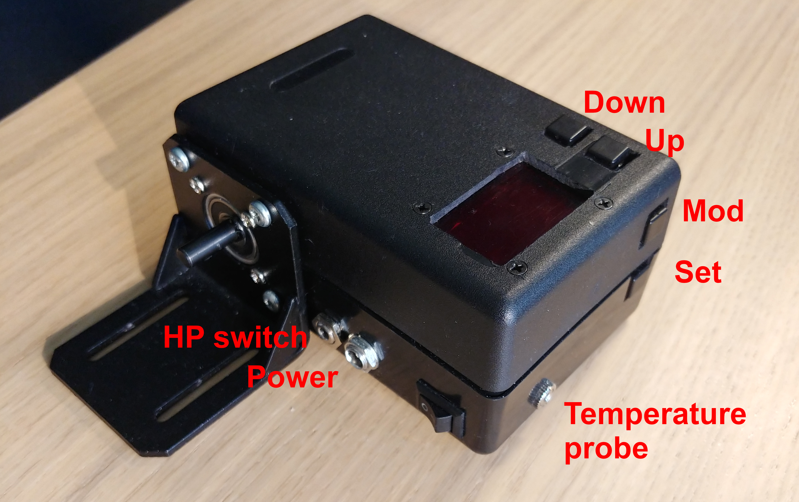

# wFocuser hardware

I offer here the "design" of my focuser for inspiration, including the [PCB design for KiCAD](wFocuser.kicad_pcb). The whole controller is made to fit a 60x40mm prototyping perfboard. The ESP32 should be connected to a socket at the back of the PCB. The other components can fit on the front/top, but you can also mount some of them to the back if you want (e.g. some resistors). The front and back Cu lines (red and blue) are meant just to avoid crossing, but in practice you may sometimes need (or prefer) to wire them otherwise. So do the remaining dark lines indicate a third level of wiring that should cross both the first two. (I actually really used a thin wire with black isolation for them, but also for some other interconnections.) I also used 35V capacitors C1 and C4; I suppose you could just use 16V types and spare some space.

**DISCLAIMER & WARNING**
- I have no idea how to use KiCAD and how to design PCBs. I just needed to find out how to fit all the components to a small prototyping board before I actually wire it together. So I installed KiCad and played with it without reading any documentation,  tutorial or even any howto. Feel free to show me how to do it properly! ;}
- I am very unhandy - especially when cutting holes, but also when soldering. I am sorry if the pictures scare you. Just get the idea from distance and do not enlarge them more than necessary!

## Hardware changes to the original myFocuser design

- two additional buttons (MOD and SET) added to GPIO 39 and 36, incl. two additional pull-down resistors identical to R1/R2
- the second button (DOWN) is (by accident) wired to GPIO 25 instead of 35, but you can also extend the line to pin 35 if you want to keep the original assignment
- all buttons are directly soldered to the board; they can be easily controlled by a single hand (three fingers); but you can replace them with pin headers as well
- there is no J15 header to connect a joystick nor J16/J17 jumpers to enable the pushbuttons; the pushbuttons are just "enabled" by default
- there are no J9/J12 headers for IN/OUT LEDs (but they would still easily fit on the board if you desired)
- there is no J13 header for an IR sensor (but it can be easily added, I suppose)
- the C5 capacitor is not located on the board, but you can wire it to the HPSW if you connect a real mechanical switch
- the J14 and J18 headers are merged into a single HPSW header (also adding power, e.g. for an alternative infrared sensor instead of a mechanical switch)
- there is no J4 header for a 12V power LED
- the polymer fuse is integrated (no J3 header needed)
- the power ON/OFF switch is just connected directly to the power wires (no J2 header needed)

## Header pinout

#### I2C DISPLAY

(1)+3.3V; (2) GND; (3) SCL; (4) SDA

#### HPSW

(1) DIAG; (2) SIGNAL; (3) +3.3V; (4) GND

Short pins 1 and 2 with a jumper in order to use StallGuard from the TM2209 DIAG pin; or connect a mechanical home position switch (including C5) to pins 2 and 4; or an IR home position sensor module to pins 2-4.

#### 12V power input

(1) +12V; (2) GND

#### TEMP SENS

(1) signal; (2) GND; (3) +3.3V

## Pictures

Yes, to make everything even worse, I am currently using JACK connectors (see the main [README](../README.md)) for HPSW and Temp probe. I am also considering connecting both of them through a single 4-pin JACK.

